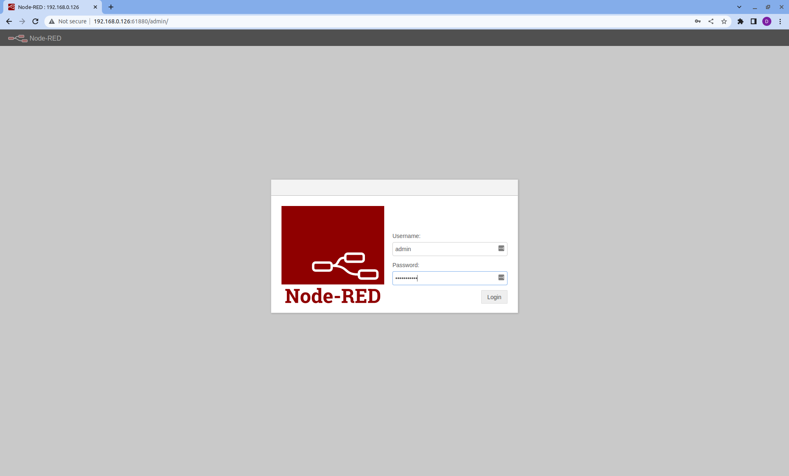
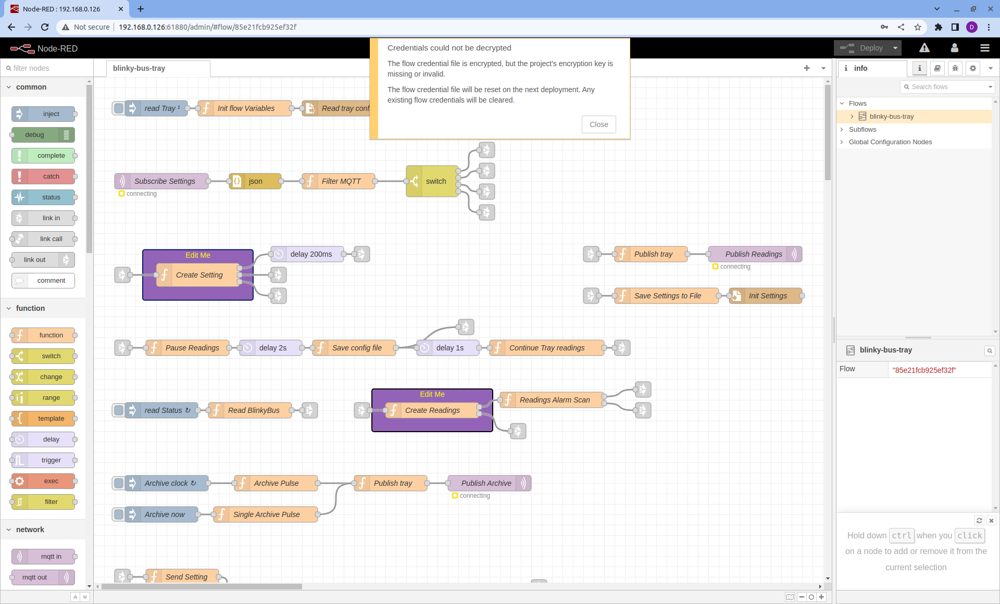
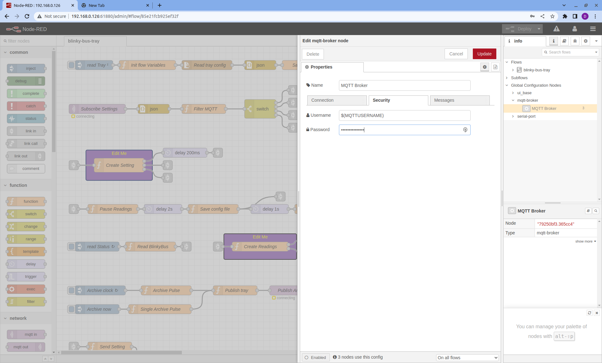
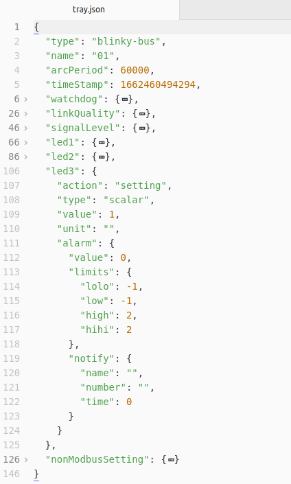

# Blinky Bus Tray
## Table of contents
* Overview
* [Preparing the Raspberry Pi](#preparing-the-raspberry-pi)
* [Pair the Cube](#pair-th-cube)
* [Install the Tray](#install-the-tray)
* [Setup the environmental file](#setup-the-environmental-file)
* [Running Node RED](#running-node-red)
* [Fixing the MQTT credentials](#fixing-the-mqtt-credentials)
* [Starting the PM2 background process](#starting-the-pm2-background-process)
* [Code Discussion](#code-discussion)
  - [The tray.json object](#the-tray.json-object)

## Overview
Blinky-Bus is a demonstration project on how to use Blinky-Lite with serial Bluetooth to communicate between the cube and tray. The function of the device is to turn on and off three LEDs. The Blinky-Lite tray software is written as a [Node-RED](https://nodered.org/) flow and can easily run on a Raspberry Pi.

You can obtain the source code for the cube by either cloning the repository or downloading a zip file from the green Code button on the [Github page](https://github.com/Blinky-Lite-Exchange/blinky-bus-tray). 
 

## Preparing the Raspberry Pi
[(contents)](#table-of-contents) 
Setup an Raspberry Pi with the latest [32 bit Raspberry Pi OS Lite](https://www.raspberrypi.com/software/operating-systems/). It is recommended to use the Raspberry Pi [Imager](https://www.raspberrypi.com/software/). Once the Raspberry Pi is up and running, SSH into the Raspberry Pi and download version 16.15.0 of [Node.js](https://nodejs.org/en/download/)

For ARM7 (Raspberry Pi 3)

    wget https://nodejs.org/dist/v16.15.0/node-v16.15.0-linux-armv7l.tar.xz

For ARM6 (Raspberry Pi Zero)

        wget https://unofficial-builds.nodejs.org/download/release/v16.15.0/node-v16.15.0-linux-armv6l.tar.xz

Extract the file

    tar -xf node-v16.15.0-linux-armvXl.tar.xz

where X is either 6 or 7. Install the directory

    cd node-v16.15.0-linux-armvXl
    sudo cp -R * /usr/

where X is either 6 or 7. Check to see the version

    node -v

You should see v16.15.0 
Remove the installation directory

    cd ..
    rm -rf node-v16.15.0-linux-armvXl
    rm node-v16.15.0-linux-armvXl.tar.xz

where X is either 6 or 7.

PM2 is a handy service to run programs in background and on boot. Next install PM2 globally

    sudo npm install -g pm2

## Pair the Cube
[(contents)](#table-of-contents) 
Next pair the Bluetooth of the Raspberry Pi with the Bluetooth of the cube. From the Raspberry Pi:

    sudo bluetoothctl

Once inside the bluetoothctl program enter:

    scan on

A list of available bluetooth devices will start to be listed. Once you see the name of your HC06 device that was setup in the [Blinky Bus Cube](https://github.com/Blinky-Lite-Exchange/blinky-bus-cube), turn the scan off:

    scan off

and pair the HC06 device

    pair XX:XX:XX:XX:XX:XX

where *XX:XX:XX:XX:XX:XX* is the MAC address of the HC06 device you saw on the scan list. The bluetoothctl program will ask you for the PIN number you setup in the [Blinky Bus Cube](https://github.com/Blinky-Lite-Exchange/blinky-bus-cube). After you have successfully paired the HC06 device, exit the bluetoothctl program:

    exit

Now you need to bind which Serial comm device for your HC06 device. At the Raspberry Pi terminal, enter:

    sudo rfcomm bind 0 XX:XX:XX:XX:XX:XX

where *XX:XX:XX:XX:XX:XX* is the MAC address of the HC06 device. This will bind the device serial device **/dev/rfcomm0** to the list of serial devices. You can see this device now by typing:

    ls /dev

To remember this binding, edit the rc.local file:

    sudo nano /etc/rc.local

and add the line  **sudo rfcomm bind 0** ***XX:XX:XX:XX:XX:XX*** right before the **exit 0** line in the file. To exit the nano editor type ***ctrl*** **x**

## Install the Tray
[(contents)](#table-of-contents) 
From the Raspberry Pi terminal, clone the tray repository or download the zip file from the green Code button on the [Github page](https://github.com/Blinky-Lite-Exchange/blinky-bus-tray).

Change directory into the tray directory:

    cd blinky-bus-tray

Install the code

    npm install

## Setup the environmental file
[(contents)](#table-of-contents) 
The **.env** file contains environmental variables that should not be shared. A template file **env** is stored on the Github repository Copy the env file to .env file

    cp env .env
https://nodered.org/
The **.env** file should look like:

    MQTTSUBSCRIBE=blinky-lite-v4/blinky-bus/01/setting/#
    MQTTCLIENTID=blinky-bus-tray-01
    MQTTSERVERIP=aaaa
    MQTTUSERNAME=bbb
    MQTTPASSWORD=ccc
    SERIALPORT=/dev/rfcomm0
    SERIALBUFSIZE=8
    PM2NAME=blinky-bus-01
    NODEREDCONFIGSECRET=dddd

You need to change the fields **aaaa**, **bbbb**, **cccc** to the appropriate values for the Blinky-Lite application Box you are going to connect to. You also need to pick a unique secret for the **dddd** field. This secret is used to [encrypt the MQTT credentials in Node-RED](https://discourse.nodered.org/t/your-flow-credentials-file-is-encrypted-using-a-system-generated-key/18382).

## Running Node RED
[(contents)](#table-of-contents) 
Before you run Node-RED, you need to change password in the *adminAuth* field in the **settings.js** file so you will be able to view and edit the tray flow from a browser. The *adminAuth* field in the **settings.js** file is shown below.  

    adminAuth: {
        type: "credentials",
        users: [{
            username: "admin",
            password: "$2a$08$KaclKnSDZ7.pGtci1ZSOIep/Dqu582RURal12L7kbJ1bnv/SYPNFq",
            permissions: "*"
        }]
    },

The password is encypted using bcrypt. Generate a new password using one of the many [internet sites](https://bcrypt-generator.com/) that provide encryption for passwords.

To run Node-RED us the script in the tray directory

    ./run-blinky-lite.sh $(pwd)

Open a browser and enter into the address bar of the browser:

    http://AAA.BBB.CCC.DDD:61880/admin

where ***AAA.BBB.CCC.DDD*** is the IP address of the Raspberry Pi and **61880** is the uiPort specified in the settings.js file. The browser will display:

 

## Fixing the MQTT credentials
[(contents)](#table-of-contents) 
Enter the username and password defined in the adminAuth block of settings.js You will most likely see the following screen with an error message that the credentials could not be decrypted

 

Close the error message and on the right hand side of the screen is an info panel.
* Expand the **Global Configuration Nodes** tree item,
* and then expand the **mqtt-broker** tree item.
* Next double click on the **MQTT Broker** icon
* and select the Security menu of the **Edit mqtt-broker node** panel that slid open
* To pickup the environmental variables specified in the .env file, enter:
  - $(MQTTUSERNAME) in the Username box
  - $(MQTTPASSWORD) in the Password box

 

* Press the **Update** button to close **Edit mqtt-broker node** panel
* Press the **Deploy** button to load the flow.

The flow should be working with green boxes underneath the light purple MQTT nodes indicating that they are connected.

 

## Starting the PM2 background process
[(contents)](#table-of-contents) 
Return to the terminal on the Raspberry Pi and terminate the Node-RED script by typing ***ctrl c***. Start the PM2 script to run Node-RED in background:

    ./pm2.sh $(pwd)

Save the PM2 state of the Raspberry Pi:

    pm2 save

To have the PM2 process start at boot:

    pm2 startup systemd

The command will return with a command to paste that looks like:

    sudo env PATH=$PATH:/usr/bin /usr/lib/node_modules/pm2/bin/pm2 startup systemd -u pi --hp /home/pi

Paste and execute the command. Now the tray will start automatically on boot.

## Code Discussion
### The tray.json object
[(contents)](#table-of-contents) 
The purpose of the Blinky-Lite tray is to package the data coming from the cube and send this data to the application box. Instead of sending many name-value pairs, the tray packages all of the cube data into a single [JSON object](https://www.w3schools.com/js/js_json_objects.asp). The definition of the tray JSON object is defined in the **tray.json** file.

 

* Trays with the same **type** should behave the same way.
* The **name** value distinguishes trays of the same **type**
  - Note that the **type** and **name** must match the [MQTTSUBSCRIBE ](#setup-the-environmental-file) environmental variable
* The **arcPeriod** defines how often (in milli Seconds) the application box should archive the tray.
* The **timeStamp** will be used by the application box to time stamp the tray data. It is in JavaScript millSeconds since Jan 1 1970.
* The **watchdog** is an optional cube object that the tray can increment to indicate the tray is functioning.
* The **linkQuality** and **signalLevel** are optional cube objects that describe the strength of the wireless signal of the Raspberry Pi determined by **iwconfig**.
* The **ledX** cube objects are specific to the cube and describe the LED's behavior.
  - The **action** determines if it is a reading or a setting
  - The **type** can be scalar (single number), vector [[],[]], or text
  - The **value** and **unit** are self explanatory
  - The **alarm** object is for scalar data types
    * an alarm value of 0 means the cube value is between *low* and *high* limits
    * an alarm value of 1 means the cube value is less than the *low* limit
    * an alarm value of 2 means the cube value is greater than the *high* limit
    * an alarm value of 3 means the cube value is less than the *low* limit
    * an alarm value of 4 means the cube value is greater than the *hihi* limit
    * The **notify** object is used by the application box to send an SMS if there is an alarm
